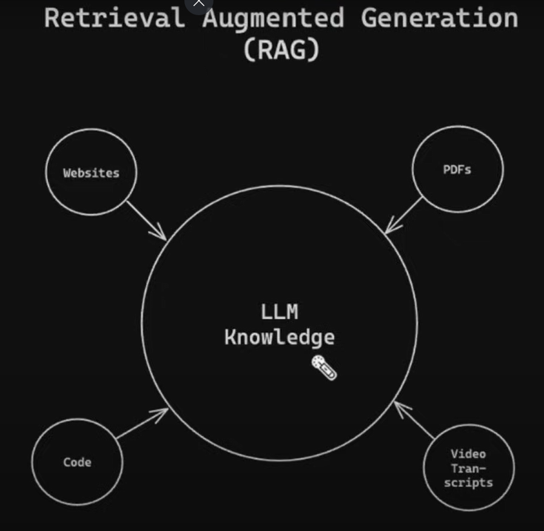
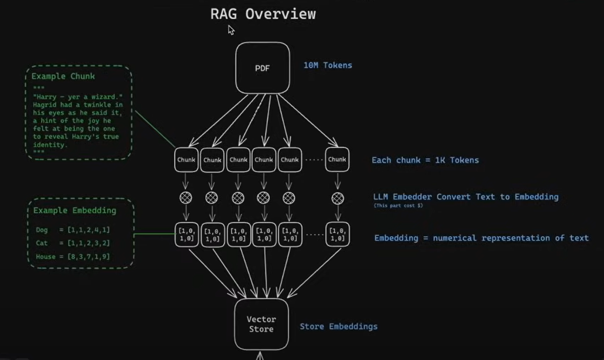
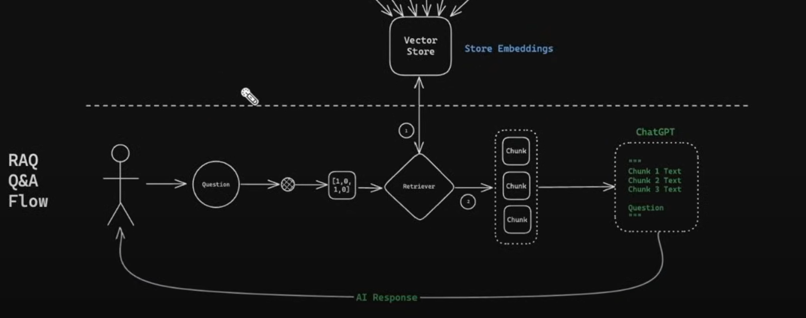

Give the LLM additionnal information

## 1a

https://youtu.be/yF9kGESAi3M?si=Fwfad6j9nC_jZMol&t=5313

## 1b

 LangChainDeprecationWarning: The class `Chroma` was deprecated in LangChain 0.2.9 and will be removed in 1.0. An updated version of the class exists in the langchain-chroma package and should be used instead. 
 
 To use it run `pip install -U langchain-chroma` and import as `from langchain_chroma import Chroma`.
 
 db = Chroma(persist_directory=persistent_directory,
No relevant docs were retrieved using the relevance score threshold 0.9

## Metadata

[j'en suis là](https://youtu.be/yF9kGESAi3M?si=gIDj-OA9BpixWRWw&t=6069)